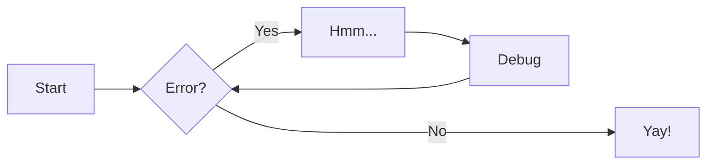
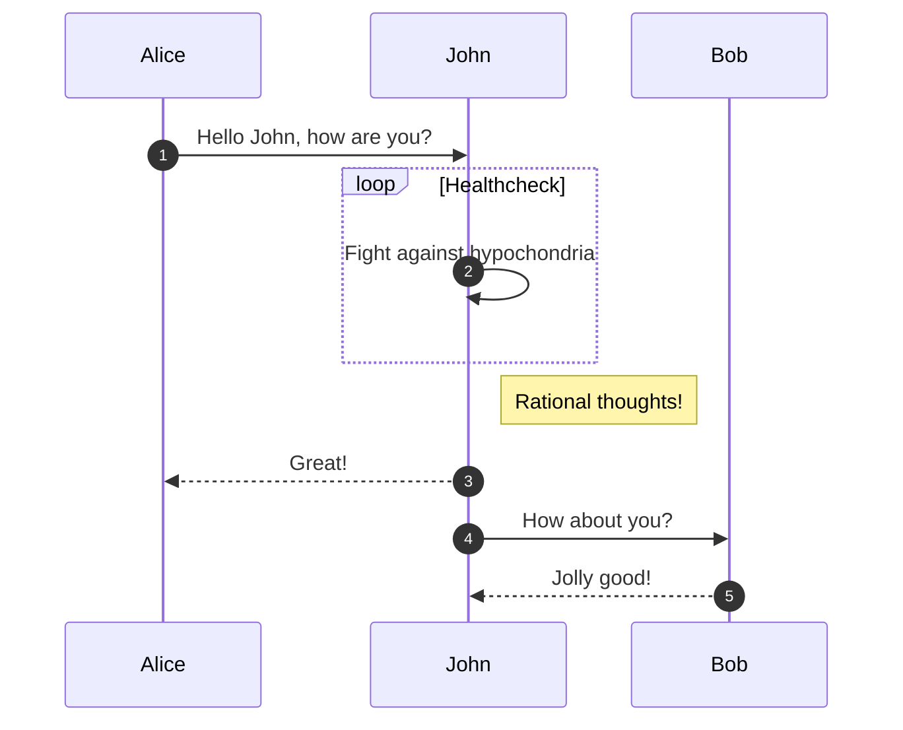
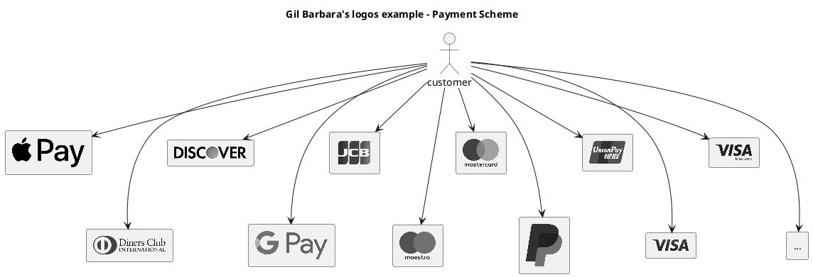
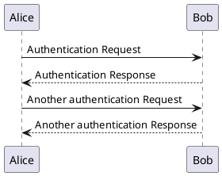
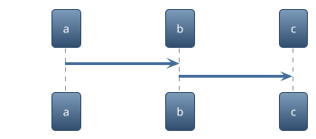
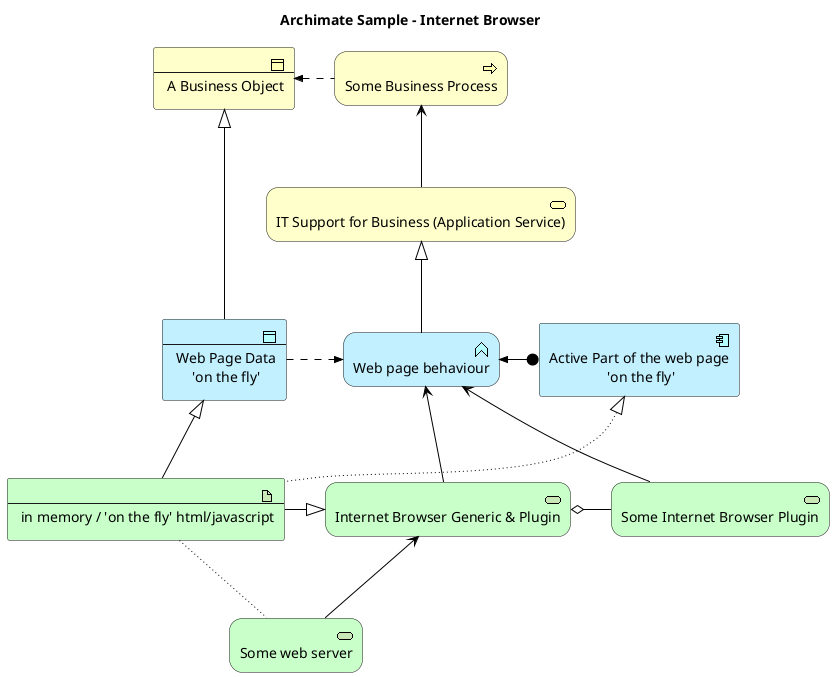
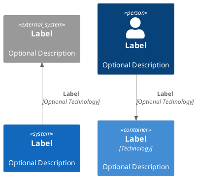
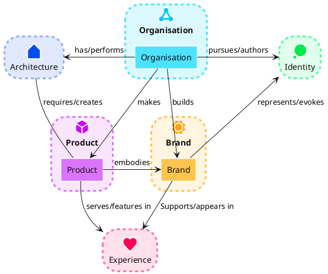

# Diagrams

## Mermaid

<https://squidfunk.github.io/mkdocs-material/reference/diagrams/>

``` mermaid
graph LR
  A[Start] --> B{Error?};
  B -->|Yes| C[Hmm...];
  C --> D[Debug];
  D --> B;
  B ---->|No| E[Yay!];
```

``` mermaid
sequenceDiagram
  autonumber
  Alice->>John: Hello John, how are you?
  loop Healthcheck
      John->>John: Fight against hypochondria
  end
  Note right of John: Rational thoughts!
  John-->>Alice: Great!
  John->>Bob: How about you?
  Bob-->>John: Jolly good!
```

## Plantuml

```plantuml
@startuml
!include <logos/apple-pay>
!include <logos/dinersclub>
!include <logos/discover>
!include <logos/google-pay>
!include <logos/jcb>
!include <logos/maestro>
!include <logos/mastercard>
!include <logos/paypal>
!include <logos/unionpay>
!include <logos/visaelectron>
!include <logos/visa>
' ...

title Gil Barbara's logos example - **Payment Scheme**

actor customer
rectangle "<$apple-pay>"    as ap
rectangle "<$dinersclub>"   as dc
rectangle "<$discover>"     as d
rectangle "<$google-pay>"   as gp
rectangle "<$jcb>"          as j
rectangle "<$maestro>"      as ma
rectangle "<$mastercard>"   as m
rectangle "<$paypal>"       as p
rectangle "<$unionpay>"     as up
rectangle "<$visa>"         as v
rectangle "<$visaelectron>" as ve
rectangle "..." as etc

customer --> ap
customer ---> dc
customer --> d
customer ---> gp
customer --> j
customer ---> ma
customer --> m
customer ---> p
customer --> up
customer ---> v
customer --> ve
customer ---> etc
@enduml
```

```plantuml
@startuml
Alice -> Bob: Authentication Request
Bob --> Alice: Authentication Response

Alice -> Bob: Another authentication Request
Alice <-- Bob: Another authentication Response
@enduml
```

```plantuml
@startuml
!theme spacelab
a -> b
b -> c
@enduml
```

```plantuml
@startuml
!include <archimate/Archimate>

title Archimate Sample - Internet Browser

' Elements
Business_Object(businessObject, "A Business Object")
Business_Process(someBusinessProcess,"Some Business Process")
Business_Service(itSupportService, "IT Support for Business (Application Service)")

Application_DataObject(dataObject, "Web Page Data \n 'on the fly'")
Application_Function(webpageBehaviour, "Web page behaviour")
Application_Component(ActivePartWebPage, "Active Part of the web page \n 'on the fly'")

Technology_Artifact(inMemoryItem,"in memory / 'on the fly' html/javascript")
Technology_Service(internetBrowser, "Internet Browser Generic & Plugin")
Technology_Service(internetBrowserPlugin, "Some Internet Browser Plugin")
Technology_Service(webServer, "Some web server")

'Relationships
Rel_Flow_Left(someBusinessProcess, businessObject, "")
Rel_Serving_Up(itSupportService, someBusinessProcess, "")
Rel_Specialization_Up(webpageBehaviour, itSupportService, "")
Rel_Flow_Right(dataObject, webpageBehaviour, "")
Rel_Specialization_Up(dataObject, businessObject, "")
Rel_Assignment_Left(ActivePartWebPage, webpageBehaviour, "")
Rel_Specialization_Up(inMemoryItem, dataObject, "")
Rel_Realization_Up(inMemoryItem, ActivePartWebPage, "")
Rel_Specialization_Right(inMemoryItem,internetBrowser, "")
Rel_Serving_Up(internetBrowser, webpageBehaviour, "")
Rel_Serving_Up(internetBrowserPlugin, webpageBehaviour, "")
Rel_Aggregation_Right(internetBrowser, internetBrowserPlugin, "")
Rel_Access_Up(webServer, inMemoryItem, "")
Rel_Serving_Up(webServer, internetBrowser, "")
@enduml
```

```plantuml
@startuml
!include <C4/C4_Container>

Person(personAlias, "Label", "Optional Description")
Container(containerAlias, "Label", "Technology", "Optional Description")
System(systemAlias, "Label", "Optional Description")

System_Ext(extSystemAlias, "Label", "Optional Description")

Rel(personAlias, containerAlias, "Label", "Optional Technology")

Rel_U(systemAlias, extSystemAlias, "Label", "Optional Technology")
@enduml
```

```plantuml
@startuml
!include <edgy/edgy>

$experienceFacet(Experience, experience)
$architectureFacet(Architecture, architecture)
$identityFacet(Identity, identity)

$organisationFacet(Organisation, org) {
	$organisation(Organisation, organisation)
}

$brandFacet(Brand) {
	$brand(Brand, brand)
}

$productFacet(Product){
	$product(Product, product)
}

$flow(brand, identity, "represents/evokes")
$flow(brand, experience, "Supports/appears in")

$flowLeft(organisation, identity, "pursues/authors")
$flowRight(organisation, architecture, "has/performs")

$flow(product, experience, "serves/features in")
$linkUp(product, architecture, "requires/creates")

$flow(organisation, brand, "builds")
$flow(organisation, product, "makes")
$flowLeft(product, brand, "embodies")

@enduml
```
