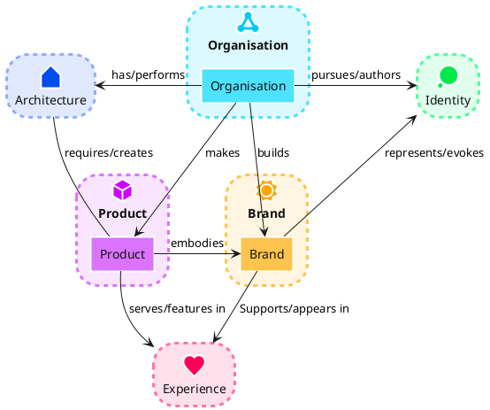

# mkdocs-flake

- :simple-materialformkdocs: Pre-Bundled easy to use [Mkdocs](https://www.mkdocs.org/)
- :simple-materialdesign: Cool [Mkdocs Material Design](https://squidfunk.github.io/mkdocs-material)
- :material-image-edit: Markdown-integrated [PlantUML](https://plantuml.com/)
- :octicons-code-review-24: [Code Blocks](https://squidfunk.github.io/mkdocs-material/reference/code-blocks/) with highlights and annotations
- :simple-nixos: Available as [Nix](https://nixos.org/) Flake
- :simple-nixos: Available as [Flake-parts](https://flake.parts/) module
- :simple-docker: Available as [Docker](https://www.docker.com/) Image

## Tooltips

bla
[Hover me](https://example.com "I'm a tooltip!") bla.
lol

## Math

<https://squidfunk.github.io/mkdocs-material/reference/math/#katex-mkdocsyml>

$$
\operatorname{ker} f=\{g\in G:f(g)=e_{H}\}{\mbox{.}}
$$

!!! note

    Lorem ipsum dolor sit amet, consectetur adipiscing elit. Nulla et euismod
    nulla. Curabitur feugiat, tortor non consequat finibus, justo purus auctor
    massa, nec semper lorem quam in massa.

bla bla

{ width="400" }

[Send :fontawesome-solid-paper-plane:](#){ .md-button }

## PlantUML Diagrams

