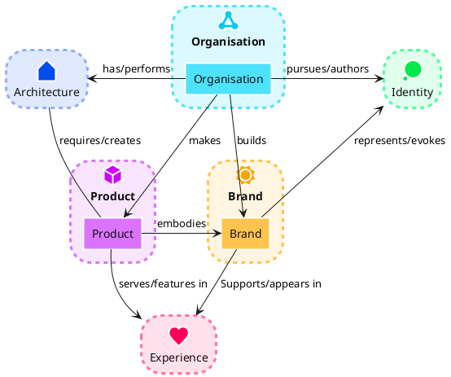

# mkdocs-flake

!!! note

    Lorem ipsum dolor sit amet, consectetur adipiscing elit. Nulla et euismod
    nulla. Curabitur feugiat, tortor non consequat finibus, justo purus auctor
    massa, nec semper lorem quam in massa.

bla bla

[Send :fontawesome-solid-paper-plane:](#){ .md-button }

## PlantUML Diagrams

