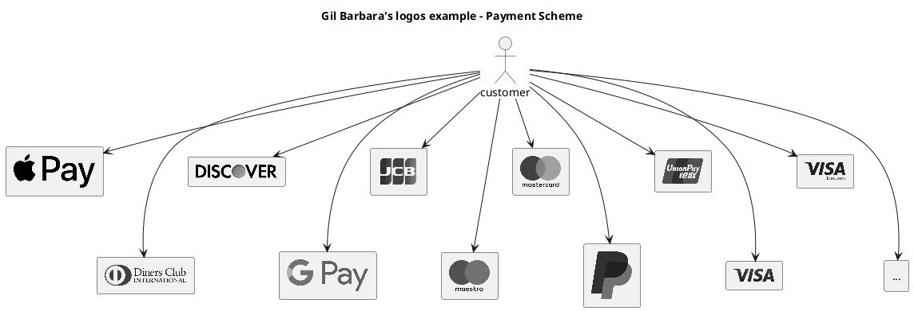
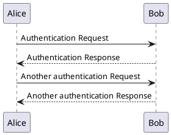
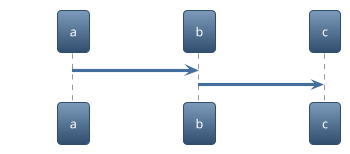
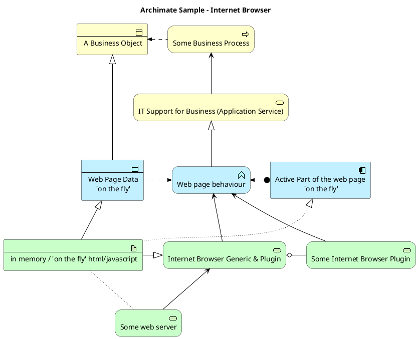
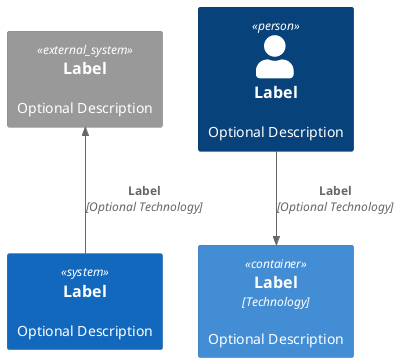

# mkdocs-flake

This project makes integrating `mkdocs` with many plugins to your project easy.

<figure markdown="span">
  { width="400" }
  <figcaption>Documentation should be easy and pretty</figcaption>
</figure>

<div class="grid cards" markdown>

- :simple-materialformkdocs: Pre-Bundled easy to use [Mkdocs](https://www.mkdocs.org/)
- :simple-materialdesign: Cool [Mkdocs Material Design](https://squidfunk.github.io/mkdocs-material)
- [:material-image-edit: Markdown-integrated [PlantUML](https://plantuml.com/)](reference/diagrams.md)
- [:octicons-code-review-24: [Code Blocks](https://squidfunk.github.io/mkdocs-material/reference/code-blocks/) with highlights and annotations](reference/code.md)
- :simple-nixos: Available as [Nix](https://nixos.org/) Flake
- :simple-nixos: Available as [Flake-parts](https://flake.parts/) module
- :simple-docker: Available as [Docker](https://www.docker.com/) Image

</div>

## Try it

### Nix

The best way to use this project is via [Nix](https://nixos.org).

1. [Install Nix](https://nixos.org/download/)
2. Run this command inside your mkdocs project:
  ```console
  nix run github:applicative-systems/mkdocs-flake
  ```

That's it, you can live-edit your documentation.

To do more, as publishing it on GitHub automatically via your CI, please have
a look at our [integration docs](integration/index.md)

### Docker

This repo generates a docker image.

TODO: Document

TODO: Provide dockerhub image from
<https://hub.docker.com/r/applicativesystems/mkdocs>

## Plugins

### Diagrams

[Mermaid](https://squidfunk.github.io/mkdocs-material/reference/diagrams/#usage)
works out of the box, but we also added [PlantUML]() support!

Plantuml is a bit more sophisticated than Mermaid and contains a
[standard library](https://plantuml.com/stdlib)
with many useful icons and styles.









Worth mentioning is especially the [C4](https://c4model.com/) standard library:




### Code

The code blocks with annotation support as
[documented by mkdocs-material](https://squidfunk.github.io/mkdocs-material/reference/code-blocks/)
work out of the box:

``` py title="bubble_sort.py"
def bubble_sort(items):
    for i in range(len(items)):
        for j in range(len(items) - 1 - i): # (1)
            if items[j] > items[j + 1]:
                items[j], items[j + 1] = items[j + 1], items[j]
```

1.  :man_raising_hand: I'm a code annotation! I can contain `code`, __formatted
    text__, images, ... basically anything that can be written in Markdown.

### Math

You can use [MathJax](https://squidfunk.github.io/mkdocs-material/reference/math/#mathjax)
and [KaTeX](https://squidfunk.github.io/mkdocs-material/reference/math/#katex)
out of the box:

$$
\operatorname{ker} f=\{g\in G:f(g)=e_{H}\}{\mbox{.}}
$$
