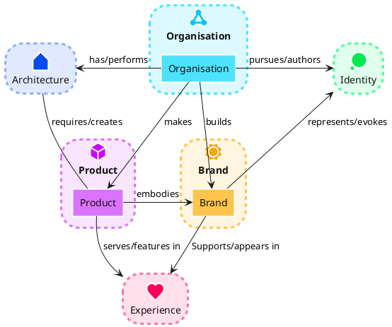
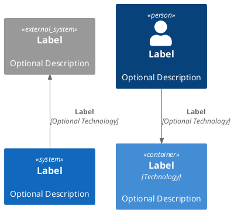
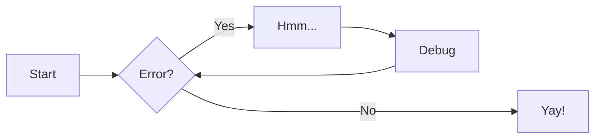
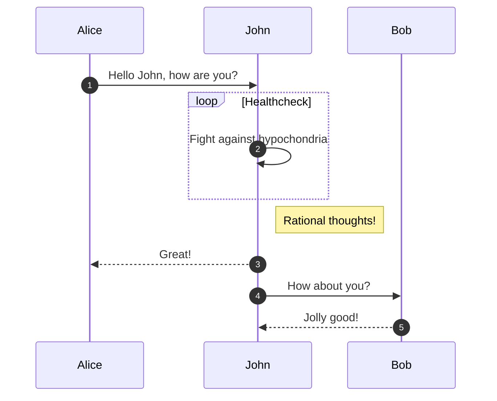

This mkdocs distribution provides two ways to provide diagrams that are
calculated from semantic text input:

## Plantuml

[PlantUML](https://plantuml.com/) is a feature rich application that comes
bundled with many different styles of graphs, third-party standard libraries,
and icon sets with brands and company logos.

Different to Mermaid diagrams, the PlantUML plugin renders your diagram
descriptions to PNG format at build time.

### Examples

```` markdown title="PlantUML chart"

````


Worth mentioning is especially the [C4](https://c4model.com/) standard library:

```` markdown title="PlantUML chart"

````


## Mermaid

As Mermaid diagrams are supported out of the box, please have a look at the
[mkdocs-material documentation](https://squidfunk.github.io/mkdocs-material/reference/diagrams/)
for more infos.

### Examples

```` markdown title="Mermaid Graph Example"

````


```` markdown title="Mermaid Sequence Example"

````


